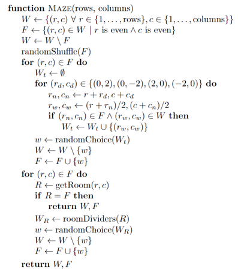

# 4M26 PostGrad
This repo contains the code for a video game which explores key concepts around
automata, search, and content generation. You can begin by installing and playing
the game. 

## Getting Started
On posix:

    python -m venv .env
    . .env/bin/activate
    pip install --upgrade pip
    pip install -e .
    postgrad


On Windows:

    python -m venv .env
    .env\Scripts\activate
    python -m pip install --upgrade pip
    pip install -e .
    postgrad

You should see the following screen pop up:


You can select which grad you want using the <kbd>a</kbd>/<kbd>←</kbd> to move left, and <kbd>d</kbd>/<kbd>→</kbd> to move right. Start by pressing <kbd>w</kbd>/<kbd>↑</kbd>. During play, you can also move down using <kbd>s</kbd>/<kbd>↓</kbd>. Once you start, you should see the following screen:


The aim of gameplay is to avoid the professors as long as you can, while gathering all the dots in your search for free food. As you play, think about these questions:

- What are the moving parts?
- What information needs to be tracked?
- What are the interacting systems?
- What can go wrong?
- What use cases are there?
- How do we represent the game?

## Agent-Based Models

This game is an example of an agent-based model, which is characterised the following properties:

1. Multiple indepedent agents, who act based on observations of their environment
2. A simulation loop which presents the state of the environment to the agents, gathers their actions, and then updates the environment.
3. Behaviour which emerges from the environment by complex, unplanned interactions between the agents.

A classic example of an agent-based model is Conway's Game of Life:


In this model each square is an agent, which acts in the following way:

1. If the agent is alive and has fewer than 2 neighbors or greater than 3 neighbors which are alive, it dies
2. If the agent is dead and has 3 neighbors that are alive it becomes alive

These simple rules can result in elaborate patterns, complex equilibria, and also complete chaos. These simple agents are examples of _finite state automata_.

## Finite State Automata

Here is the automaton which describes an agent in Conway's Game of Life:


Here is an example of how to code this into a Python class:

```python
class Cell(NamedTuple("Cell", [("row", int), ("column", int)])):
    def neighbors(self):
        for dr in (-1, 0, 1):
            for dc in (-1, 0, 1):
                if dr == dc == 0:
                    continue
                yield Cell(self.row + dr, self.column + dc)

    def step(self, live_cells: Set["Cell"]) -> bool:
        count = sum(n in live_cells for n in self.neighbors())
        if count == 3:
            return True

        return count == 2 and self in live_cells
```

Note the use of `NamedTuple` here. This is a very useful class for use in systems like this because it provides the immutability of a Tuple (and thus the ability to be stored in a `set`) while providing intelligible member names.  The outer simulation for the Game of Life looks like this:

```python
class GameOfLife:
    def __init__(self, live_cells: Set[Cell]):
        self.live_cells = live_cells

    def step(self):
        new_live_cells = set()
        for cell in self.live_cells:
            if cell.step(self.live_cells):
                new_live_cells.add(cell)
            for n in cell.neighbors():
                if n.step(self.live_cells):
                    new_live_cells.add(n)

        self.live_cells = new_live_cells
```

To see the full code which produced the animation above, see [this code file](lecture/conway.py).

We can represent the PostGrad game itself as a series of nested finite state automata. For example, at the highest level we have the game logic:


In the same way, we can represent the state transitions of `InLevel` with a state diagram for a game level:


The grad and faculty have their own state diagrams as well, though they are less easy to draw as they have as the number of states scales with the size of the level. The grad state consists of the combination of two key properties:

| State Property |        Type        |  Transition  |
|----------------|--------------------|--------------|
| Position       | (row, column)      | Player input |
| Facing         | {UP,LEFT,DOWN,RIGHT} | Player input |

Professors have the same, with the addition of a phase:

| State Property |        Type                      | Transition  |
|----------------|----------------------------------|-------------|
| Position       | (row, column)                    |     AI      |
| Facing         | {UP,LEFT,DOWN,RIGHT}             |     AI      |
| Phase          | {IN_ROOM,CHASE,FRIGHTENED,ASKED} | Game/Timers |

The Phase transitions are governed by either player actions (number of positions reached) or timers:

| Phases     | Transition   | Info       |
|------------|--------------|------------|
| IN_ROOM    | Player Steps | Varies     |
| SCATTER    | Timer        | 7s         |
| CHASE      | Timer        | 20s        |
| SCATTER    | Timer        | 7s         |
| CHASE      | Timer        | 20s        |
| SCATTER    | Timer        | 5s         |
| CHASE      | Timer        | 20s        |
| SCATTER    | Timer        | 5s         |
| CHASE      | Timer        | Remainder  |
| FRIGHTENED | Game         | Wander     |
| ASKED      | Game         | Go to room |

To learn more about how all of this is implemented, see the following files:

- [State enumerations](src/postgrad/core.py)
- [Game state](src/postgrad/game.py)
- [Level state](src/postgrad/postgrad.py)
- [Faculty state and phases](src/postgrad/faculty.py)

## Professor AI

The Professor agents act following simple rules that are enabled via a classical form of AI. The behaviour falls into two general categories: scattering, and chasing. When scattering, they take on the following movement pattern:


When chasing, however, each professor has their own goals they try to achieve.

### Professor Blink

Professor Blink goes right for the grad student by the shortest possible path.


In code, the per-phase goals look like this:

```python
def blink(level: Level, phase: ProfessorState, info: GameInfo) -> Vec2:
    match phase:
        case ProfessorState.IN_ROOM:
            return info.faculty.blink.pos
        case ProfessorState.SCATTER:
            return info.scatter.blink
        case ProfessorState.CHASE:
            return info.grad.pos
        case ProfessorState.FRIGHTENED:
            return choose_random_turn(level, info.faculty.blink,
                                      info.scatter.blink)
        case ProfessorState.ASKED:
            return info.start.blink
```

### Professor Pink

Professor Pink is always aiming for the spot right in front of the grad student:


```python
def pink(level: Level, phase: ProfessorState, info: GameInfo) -> Vec2:
    match phase:
        case ProfessorState.IN_ROOM:
            return info.faculty.pink.pos
        case ProfessorState.SCATTER:
            return info.scatter.pink
        case ProfessorState.CHASE:
            return info.grad.pos.move(info.grad.facing, 2 * level.tilesize)
        case ProfessorState.FRIGHTENED:
            return choose_random_turn(level, info.faculty.pink,
                                      info.scatter.pink)
        case ProfessorState.ASKED:
            return info.start.pink
```

### Professor Ink

Professor Ink has a complex goal which is governed both by the location of the grad student and Professor Blink. See the diagram below:


The goal is a function of the space in front of the grad student combined with the directional vector of Professor Blink's location in relation tot hat space.  In code:

```python
def ink(level: Level, phase: ProfessorState, info: GameInfo) -> Vec2:
    match phase:
        case ProfessorState.IN_ROOM:
            return info.faculty.ink.pos
        case ProfessorState.SCATTER:
            return info.scatter.ink
        case ProfessorState.CHASE:
            pos = info.grad.pos.move(info.grad.facing, level.tilesize)
            return pos + (pos - info.faculty.blink.pos)
        case ProfessorState.FRIGHTENED:
            return choose_random_turn(level, info.faculty.ink,
                                      info.scatter.ink)
        case ProfessorState.ASKED:
            return info.start.ink
```

### Professor Sue

Professor Sue has the same logic as Professor Blink, except once she is within 4 tiles of the grad student she reverts to her scatter behaviour:


The points marked with an `x` are where her movement goals change due to proximity.  In code:

```python
def sue(level: Level, phase: ProfessorState, info: GameInfo) -> Vec2:
    match phase:
        case ProfessorState.IN_ROOM:
            return info.faculty.sue.pos
        case ProfessorState.SCATTER:
            return info.scatter.sue
        case ProfessorState.CHASE:
            dist = (info.grad.pos - info.faculty.sue.pos).l1norm()
            if dist > 4 * level.tilesize:
                return info.grad.pos
            return info.scatter.sue
        case ProfessorState.FRIGHTENED:
            return choose_random_turn(level, info.faculty.sue,
                                      info.scatter.sue)
        case ProfessorState.ASKED:
            return info.start.sue
```

## A* Search

Once a professor's goal has been established, they determine which next step to take by using an algorithm called A* search. This performs a search over the high-level graph structure of the map:


Each tile is represented here by a red square (denoting a node in teh graph), and the edges between nodes are represented with green lines. The blue lines on the edges of the level indicate the fact that the right-most tile is the left-most neighbour of the left-most tile (and vice versa).

The A* algorithm looks like this:


Here is the algorithm in action:


Here is an implementation in Python:

```python
def astar(distance, heuristic, neighbors, is_goal, start):
    frontier = []
    heappush(frontier, (0, 0, start))
    came_from = {start: None}
    cost_so_far = {start: 0}

    while frontier:
        _, _, x = heappop(frontier)

        if is_goal(x):
            return reconstruct_path(came_from, x)

        for y in neighbors(x):
            new_cost = cost_so_far[x] + distance(x, y)
            if new_cost < cost_so_far.get(y, float("inf")):
                cost_so_far[y] = new_cost
                h = heuristic(y)
                priority = new_cost + h
                heappush(frontier, (priority, h, y))
                came_from[y] = x

    return None
```

An important implementation detail here is that the priority ($F$ from the algorithm) is the first element of a tuple that is added to the priority queue using `heappush`. However, the heuristic itself is used as the second member. This is for use in breaking ties between competing priorities, which has significant impact on time to termination. Finally, we have the next state `y`. The use of a priority queue in general greatly reduces the cost of the algorithm by making extraction of the next node $O(log n)$.

However, in the case of the PostGrad game, we cannot simply navigate the level graph. A limitation on the professor AI is that it cannot change direction during a phase. As such, its actions are limited by its current facing, like so:

|       | (r+1, c)       | (r, c+1)        | (r-1, c)     | (r, c-1)       |
|-------|----------------|-----------------|--------------|----------------|
| UP    |                | (r, c+1), RIGHT | (r-1, c), UP | (r, c-1), LEFT |
| LEFT  | (r+1, c), DOWN |                 | (r-1, c), UP | (r, c-1), LEFT |
| DOWN  | (r+1, c), DOWN | (r, c+1), RIGHT |              | (r, c-1), LEFT |
| RIGHT | (r+1, c), DOWN | (r, c+1), RIGHT | (r-1, c), UP |                |

This means that we have to perform A* search over a three-dimensional state space: rows, columns, and facings. Here is an example of that in Python:

```python
AStarState = NamedTuple("State", [("tile", Tile), ("facing", Direction)])

def valid_neighbors(graph: TileGraph, tile: Tile, facing: Direction) -> List[AStarState]:
    edges = graph.edges[tile]
    return [AStarState(edges[f], f) for f in Direction
            if f in edges and f != facing.opposite()]

def shortest_path_facing(graph: TileGraph, start: AStarState, goal: Tile) -> List[AStarState]:
    def distance(a: AStarState, b: AStarState):
        return a.facing.distance(b.facing) + (a.tile - b.tile).l1norm()

    def heuristic(a: AStarState):
        return (a.tile - goal).l1norm()

    def neighbors(a: AStarState):
        return valid_neighbors(graph, a.tile, a.facing)

    def is_goal(a: AStarState):
        return a.tile == goal

    path = astar(distance, heuristic, neighbors, is_goal, start)
    return path
```

## Procedural Content Generation

After the first level of the game, we want to generate random maps which still have all the important properties of the first level. In short, we want to generate text files like this:

```
###################
#........#........#
#P##.###.#.###.##P#
#.................#
#.##.#.#####.#.##.#
#....#...#...#....#
####.###.#.###.####
####.#.......#.####
####.#.FF1FF.#.####
L......F234F......R
####.#.FFFFF.#.####
####.#...I...#.####
####.#.#####.#.####
#........#........#
#.##.###.#.###.##.#
#P.#.....S.....#.P#
##.#.#.#####.#.#.##
#....#...#...#....#
#.######.#.######.#
#.................#
###################
```

Which correspond to a level like this:


This is a form of rejection sampling. Let's say we wanted to create the following endearingly nerdy St. Valentine's card:


In short, we want to sample from a uniform distribution shaped like a heart. This forms our target distribution $X$, and we can use a shape mask to accept or reject samples. The samples themselves are drawn from a proposal distribution, $Y$, in this case the 2D uniform distribution. As long as the support of $X$ is subsumed within the support of $Y$ (obvious here from inspection), this strategy works provided we reject all the invalid samples (black here).

For our maps, $X$ is the constraints we have for our game maps, which are:

1. Faculty room in the middle
2. Warps on the right and left
3. No open rooms
4. No long corridors

However, the choice of $Y$ is less clear. We could sample all text files with the characters `#.PFS1234LR` of the needed rows and columns, but its support is much, much larger than what we need. Instead, we will use a random maze sampler as our $Y$.

### Generating Mazes

Consider the following algorithm for generating a maze:



It has three steps:

1. Poke one-tile holes in a regular grid
2. Remove walls between these holes at random
3. Detect isolated rooms and join them

The end result is a maze in which each tile is reachable from every other tile, as we can see in this animation:


In practice, we tailor this algorithm even further to make its support a tighter fit and reduce the rejection rate. For full details, see [this code file](src/postgrad/level_generator.py).

## Replay Files

The `postgrad` script has the following usage information:

    usage: postgrad [-h] [-v] [-f] [-i] [-g] [-s] [-r REPLAY] [-l REPLAY_LENGTH]

    options:
    -h, --help            show this help message and exit
    -v, --version         show program's version number and exit
    -f, --fullscreen      Run the game in fullscreen mode
    -i, --invulnerable    Make the grad invulnerable
    -g, --show-goals      Show the goal tiles of the profs
    -s, --show-state      Show the state of the game
    -r REPLAY, --replay REPLAY
                            Path to save the replay
    -l REPLAY_LENGTH, --replay-length REPLAY_LENGTH
                            Maximum length of the replay

The `-r` option allows you to specify a directory where the game will write replay files. These files are NPZ archives which contain the following items:

1. `seed` - A random seed
2. `grad` - The select grad (a value from 0 to 3)
3. `actions` - a `(N, 2)` array of integers. Each row is the step an action was taken (which is a monotonically increasing value for an entire playthrough) and the action taken, with values taken from the enumeration below.

```python
class Action(Enum):
    """These are the actions that a sprite can take.

    Note that these actions can come from player input or from the
    faculty AI.
    """
    NONE = 0
    MOVE_UP = 1
    MOVE_DOWN = 2
    MOVE_LEFT = 3
    MOVE_RIGHT = 4
```

The replay can be viewed using the `postgrad_replay` tool:

    usage: postgrad_replay [-h] [-v VIDEO_PATH] [-i] replay_path

    Replay a game

    positional arguments:
    replay_path           Path to the replay file

    options:
    -h, --help            show this help message and exit
    -v VIDEO_PATH, --video_path VIDEO_PATH
                            Path to the video file
    -i, --invulnerable    Make the grad invulnerable

You can use this to test whether a replay file you have produced is valid.